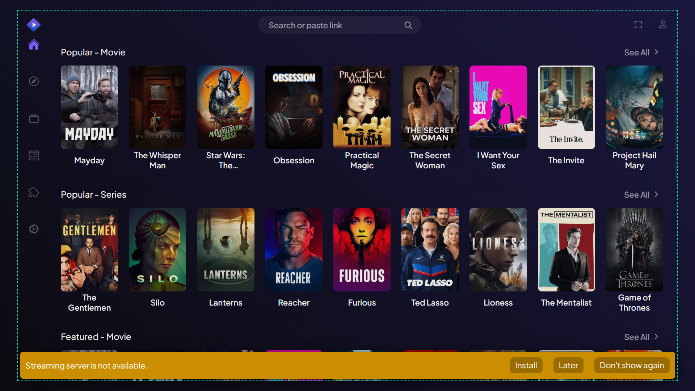
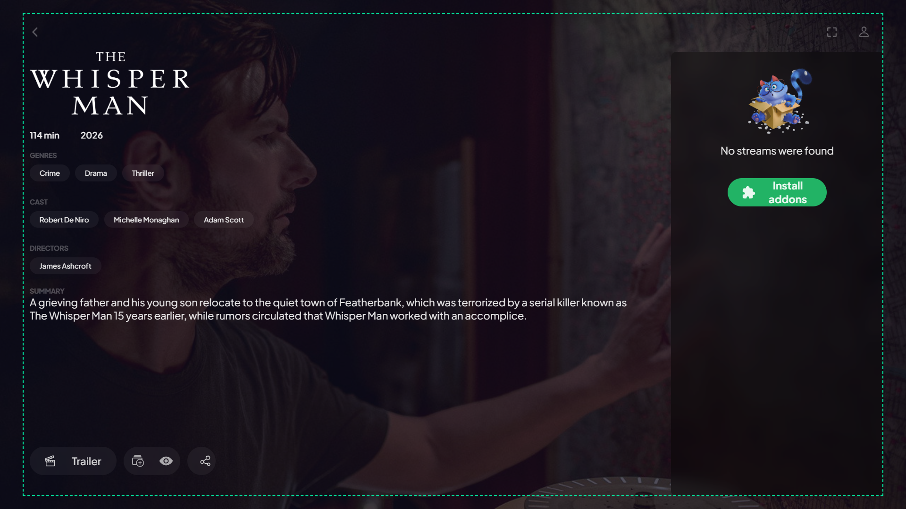
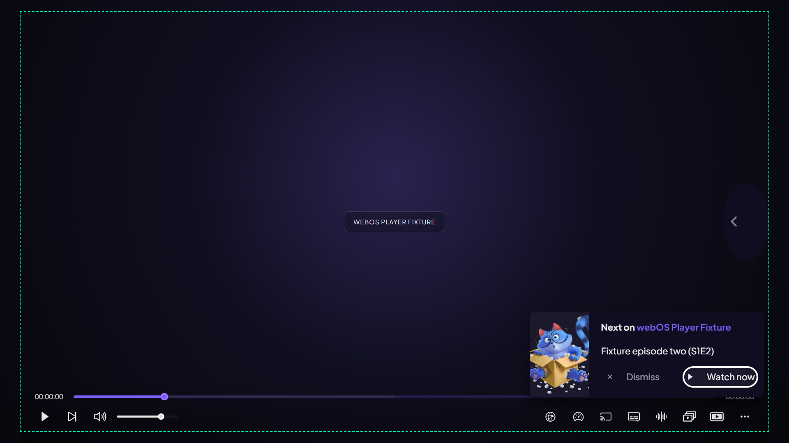

# T2.8 — Overscan e layout 1080p

Rodada: 8–9 de setembro de 2026. Trabalho feito no worktree existente, preservando T2.4–T2.7, sem commit, reset ou troca de branch.

**Resultado: implementação, testes estáticos e builds aprovados; T2.8 parcialmente aberta.** A coleta runtime local passou, mas Chromium 68/emulador e TV física continuam pendentes. R04 permanece aberto e sua classificação não foi alterada.

## Implementação

- `src/App/styles.less` centraliza os parâmetros LESS `@webos-overscan-horizontal: 48px` e `@webos-overscan-vertical: 27px`. As quatro custom properties existentes emitem esses valores, inclusive o inset inferior standalone. Não existe uma segunda camada de padding no shell.
- O frame seguro padrão é `(48,27)–(1872,1053)`, com dimensão **1824×1026px**, equivalente a 2,5% por borda de 1920×1080.
- Somente o webOS usa root e tokens de viewport fixos de 1920×1080. Os overrides de viewport dinâmico ficam exclusivos do desktop; o root webOS permanece em 15px. Nenhuma preferência ou API runtime foi adicionada.
- `src/index.html` seleciona `width=1920,height=1080,initial-scale=1,maximum-scale=1,minimum-scale=1,user-scalable=no` no webOS. O meta viewport responsivo desktop permanece igual.
- HorizontalNavBar importa os parâmetros por referência e calcula `max(0px, 15px - overscanHorizontal)` em LESS; MetaDetails calcula `max(15px, 60px - overscanHorizontal)`. Com 48px, os resultados são **0px** e **15px**. Não são funções CSS runtime.
- Search e Settings tinham `width:100%` sobrescrevendo a largura do MainNavBars, embora mantivessem suas margens laterais. A largura webOS agora desconta os insets existentes, corrigindo os botões à direita fora do frame.
- Addons reserva 4px de `scroll-padding` para o foco; isso resolveu o recorte nativo de 1,5px observado durante a coleta, sem duplicar overscan.
- O background do Player e a altura do SideDrawer usam dimensões fixas no webOS. A alça lateral fica no inset direito. O popup de próximo vídeo usa proporção 25%/75% entre imagem/informação para comportar os botões de 22px.
- Tipografia primária selecionada passou a 22px, preservando títulos maiores: navegação horizontal, buscas, inputs, botões, filtros/dropdowns, menus de Settings, labels das opções, nomes de cards, sinopses, descrições de Addons, mensagens vazias, Intro e mensagens/ações do Player. Labels primários de áudio/legendas também foram ajustados; seus detalhes técnicos menores foram preservados.
- Library e Calendar ampliam as colunas do estado sem login de 18rem para 24rem somente no webOS, acomodando os textos maiores.

### Parâmetros de compilação

```sh
corepack pnpm build:webos
corepack pnpm build:webos --env WEBOS_OVERSCAN_HORIZONTAL=48 --env WEBOS_OVERSCAN_VERTICAL=27
# Exemplo alternativo, exige nova validação visual:
corepack pnpm build:webos --env WEBOS_OVERSCAN_HORIZONTAL=96 --env WEBOS_OVERSCAN_VERTICAL=54
```

Os argumentos são pixels numéricos, repassados ao `modifyVars` do LESS. O webpack rejeita valores não finitos, negativos ou iguais/superiores à metade da dimensão correspondente. Sem argumentos, os defaults continuam definidos em App/styles.less. Desktop ignora esses argumentos. O valor físico final de overscan ainda precisa ser confirmado na TV.

## Testes e comparação desktop

| Verificação | Resultado |
|---|---|
| `pnpm test --runInBand` | 15 suítes, 374 testes aprovados |
| `pnpm lint` | Aprovado |
| `pnpm build` | Aprovado; dois avisos de tamanho de assets/entrypoints |
| `pnpm build:webos` | Aprovado; mesmos tipos de avisos |
| `pnpm check:webos-compat` | 7/7 arquivos JS compatíveis com ES2018 |
| Build debug para os probes | Aprovado |
| `git diff --check` | Aprovado |
| Scan do CSS webOS completo | Zero `env()`, `min()`, `max()` ou `clamp()` |
| CSS desktop completo antes/depois | Byte a byte idêntico, 279417 bytes |
| LESS desktop dos arquivos alterados | 49/49 saídas preservadas |

Nesta sessão, os comandos foram invocados por `corepack pnpm`, pois `pnpm` não estava no PATH. Os logs finais usam redirecionamento via `cmd /c`, evitando que mensagens normais do webpack em stderr sejam convertidas em NativeCommandError pelo PowerShell.

SHA-256 desktop antes e depois: `fb6508716c13ff55eeb24bdf1b3c737e5ede609914ffbda348354136b815e013`.

Os dez novos testes de `tests/webosLayout1080.spec.js` verificam viewport, tokens, tipografia selecionada, larguras de Search/Settings e clamps com insets horizontais **0, 10, 48 e 96px**. A suíte T2.4 foi atualizada para os novos defaults. Seu teste de desktop mantém as fórmulas originais completas. O resolvedor do teste de backdrop agora também entende o alias do CSS do router importado por referência através de App.

Artefatos: [desktop completo](t28-desktop-css.json), [comparação por arquivo](t28-source-css-comparison.json), [scan webOS](t28-webos-css.json), [Jest](t28-tests.log), [lint](t28-lint.log), [build desktop](t28-build-desktop.log), [build webOS](t28-build-webos.log), [compatibilidade](t28-compat.log). A referência fonte anterior está em `t28-source-baseline.json`; o CSS anterior em `t28-desktop-before.css`.

## Runtime local e limites

Navegador real desta rodada: **Chrome 153.0.8010.36, Windows, headless**, com métricas CDP 1920×1080/DPR 1. O User-Agent webOS seleciona a plataforma da aplicação; **não transforma o motor em Chromium 68**. Cache e service worker foram ignorados na coleta.

Em todas as dez rotas: `innerWidth=1920`, `innerHeight=1080`, viewport visual 1920×1080, escala visual 1, root 1920×1080 e insets 48/27px. **285 controles** foram focados, incluindo `tabindex=-1`, sem falhas finais de geometria ou de anel de foco detectadas. Nenhum overflow horizontal do documento foi detectado. O probe mede cada controle depois do scroll nativo, com tolerância de 1px, e considera o foco delegado ao pôster/label quando aplicável.

| Rota | Controles | Textos menores registrados | Estado efetivamente medido |
|---|---:|---:|---|
| Board | 73 | 0 | Catálogos visíveis e aviso de servidor local ausente |
| Discover | 67 | 13 | Catálogo e preview; metadados compactos preservados |
| Library | 10 | 0 | Estado sem login; query `sort=lastwatched` normalizada pelo app |
| Calendar | 10 | 0 | Estado sem login |
| MetaDetails | 15 | 13 | Metadados/sinopse e estado sem streams |
| Search | 10 | 0 | Busca idle, sem consulta |
| Player idle | 14 | 3 | Fixture existente `#/debug/player`, sem reprodução real |
| Settings | 40 | 80 | Usuário anônimo, opções e referência de atalhos |
| Addons | 30 | 12 | Addons padrão, versões/tipos preservados |
| Intro | 16 | 5 | Formulário de registro; sem envio de dados |

Os números menores correspondem aos textos presentes no DOM durante a coleta, inclusive conteúdo rolável. A geometria de controles foi medida com foco; isso não exige que todos os itens de listas roláveis caibam simultaneamente na tela. Elipses de títulos longos e recorte de itens não focados na borda de listas permanecem intencionais. O probe não é uma prova geral de ausência de sobreposição de texto; as dez capturas foram também inspecionadas visualmente. Essa inspeção motivou os ajustes no Player e nos placeholders. A alça do Player foi inspecionada visualmente: ela ainda não é focável pelo teclado no componente existente, questão de navegação para a Fase 4.

As últimas capturas de Player, Library e Calendar foram repetidas após os respectivos ajustes. Relatórios por rota são a referência final; os resumos de repetição estão em `t28-runtime-summary-player-idle-fixture.json`, `t28-runtime-summary-library.json` e `t28-runtime-summary-calendar.json`.

**Não validados nesta rodada:** estados autenticados de Library/Calendar, todas as combinações de menus/modais, streams reais, player de produção em reprodução, outras línguas, outras margens compiladas em runtime, zoom real de webOS, controle remoto físico e legibilidade a distância. A ausência do emulador foi registrada em [disponibilidade dos endpoints](t28-target-availability.json). As verificações locais não autorizam fechar R04, T2.8 ou T2.10.

## Exceções tipográficas

Cada uma das **126 ocorrências runtime menores que 21,5px** está registrada individualmente em [exceções tipográficas](t28-typography-exceptions.json), com rota, texto, classe, ancestrais, tamanho, retângulo, fonte e justificativa. Nenhuma ocorrência medida ficou sem classificação. A lista é uma decisão de composição desta rodada, sujeita à avaliação física de legibilidade.

| Superfície / seletor | Tamanho em root 15px | Motivo da exceção |
|---|---:|---|
| MetaPreview: duração, ano, avaliação | 18,75px | Linha compacta de metadados |
| MetaLinks: legendas e chips de gênero/elenco/direção | 14,25 / 15px | Muitas etiquetas na mesma composição; não são o corpo da sinopse |
| MetaPreview: legenda Summary | 14,25px | Legenda secundária; sinopse em 22px |
| Settings/Menu: versão do app e hash | 15px | Diagnóstico longo, com elipse |
| URLsManager: cabeçalho URL/Status e dados técnicos | 15px | Tabela estreita com endereços longos; Reload em 22px |
| ShortcutsGroup: títulos, descrições, teclas e separadores | 15px | Referência densa de combinações de teclado |
| Addon: `.version-container`, `.types-container` | 15px | Metadados secundários; nome/descrição maiores |
| Checkbox em Intro: consentimentos e links | 13,5px | Textos densos no formulário de 330px; pendente confirmar legibilidade física |
| SeekBar: timestamps | 16,5px | Valores tabulares compactos junto à barra |
| PlayerDebugPage: identificador do fixture | 15px | Diagnóstico, fora do produto |

Exceções de fonte preservadas na auditoria seletiva, sem comprovação runtime completa nesta rodada:

| Fonte / conteúdo | Tamanho preservado | Motivo / limite |
|---|---:|---|
| VerticalNavBar/NavTabButton `.label` | 12px | Rótulo auxiliar normalmente oculto; navegação por ícones, coluna de 90px |
| Calendar Table/Cell, List/Item, Details | 13,125–15px | Grade/lista densa de episódios; estado autenticado pendente |
| StreamsList/Stream: nome técnico, descrição e informações de release | 13,5–16,5px | Releases longos em painel de 450px; lista com streams pendente |
| MetaItem `.new-videos .label` | 12px | Badge de contagem limitado em altura |
| Video: release e badges de estado | 12px | Metadados compactos; título e opção de menu revisados para 22px |
| AudioMenu descrição de faixa; SubtitleVariant detalhes/badges | 9,75–15px | Linhas secundárias de codec/variante; língua primária em 22px |
| StatisticsMenu | 12–12,75px | Estatísticas técnicas, tabela densa |
| NumberInput controles numéricos auxiliares | 12 / 18px | Controles compactos; inputs de texto primários em 22px |
| Diagnósticos webOS e referência de atalhos/gamepad | Valores anteriores | Interface técnica fora da revisão de corpo primário |
| Tooltip, detalhes auxiliares de modais, chips/eventos e banners não presentes nas rotas medidas | Valores anteriores | Fora da revisão seletiva validada; sem garantia global de 22px para todo o app |

## Probe e reprodução

Ferramentas externas ao bundle: `tools/t28-layout-probe.js`, `tools/t28-layout-runner.mjs`, `tools/t28-css-audit.cjs`, `tools/t28-typography-report.cjs`. O probe usa sintaxe ES2018 e pode ser executado no console do alvo; não altera o código de navegação nem configurações persistidas.

```sh
corepack pnpm build:webos:debug
node tools/t28-layout-runner.mjs
node tools/t28-typography-report.cjs
node tools/t28-css-audit.cjs sources
# Depois de cada build de produção correspondente:
node tools/t28-css-audit.cjs desktop
node tools/t28-css-audit.cjs webos
```

Para emulador/TV, definir `CDP_HTTP` com o endpoint e `TARGET_HINT` com uma parte inequívoca do título/URL/id da página. Nesse modo o runner **não força as métricas do dispositivo**: deve medir o viewport e a escala reais. `T28_BUILD` seleciona uma cópia local do build e `T28_ROUTE` permite repetir apenas uma rota. O runner gera JSON por rota e duas screenshots: estado inicial e amostra com foco, ambas com o frame verde.

## Galeria final

Artefatos completos em `tests/webos/t28-*`. Os arquivos `-focus.png` complementam estas capturas iniciais. Cada JSON contém os controles, retângulos, insets, fontes, escala e falhas.

| Rota | Screenshot | Foco | JSON |
|---|---|---|---|
| Board | [imagem](t28-board.png) | [foco](t28-board-focus.png) | [relatório](t28-board.json) |
| Discover | [imagem](t28-discover.png) | [foco](t28-discover-focus.png) | [relatório](t28-discover.json) |
| Library | [imagem](t28-library.png) | [foco](t28-library-focus.png) | [relatório](t28-library.json) |
| Calendar | [imagem](t28-calendar.png) | [foco](t28-calendar-focus.png) | [relatório](t28-calendar.json) |
| MetaDetails | [imagem](t28-metadetails.png) | [foco](t28-metadetails-focus.png) | [relatório](t28-metadetails.json) |
| Search | [imagem](t28-search.png) | [foco](t28-search-focus.png) | [relatório](t28-search.json) |
| Player idle | [imagem](t28-player-idle-fixture.png) | [foco](t28-player-idle-fixture-focus.png) | [relatório](t28-player-idle-fixture.json) |
| Settings | [imagem](t28-settings.png) | [foco](t28-settings-focus.png) | [relatório](t28-settings.json) |
| Addons | [imagem](t28-addons.png) | [foco](t28-addons-focus.png) | [relatório](t28-addons.json) |
| Intro | [imagem](t28-intro.png) | [foco](t28-intro-focus.png) | [relatório](t28-intro.json) |





## Pendências de aceite

- [x] Implementação exclusiva do build webOS, parâmetros LESS e desktop preservado.
- [x] Testes estáticos, builds, compatibilidade e coleta local documentados.
- [x] Screenshots com safe frame, relatórios JSON e exceções arquivados.
- [ ] Repetir no Chromium 68/emulador e nos estados autenticados necessários.
- [ ] Validar em TV física a escala, overscan final, controle remoto e legibilidade, incluindo as exceções.
- [ ] Completar T2.10 e os demais critérios de R04 antes do encerramento do risco.
